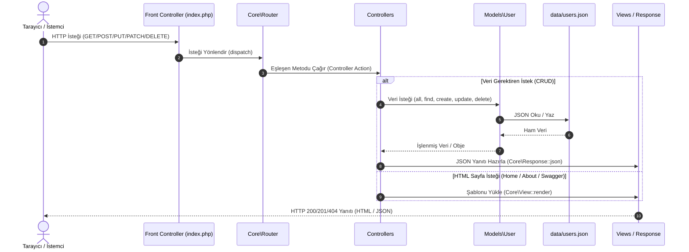

# 🎓 Alumni Tracking System (Mezun Takip Sistemi)

> **26-27 Web Programming Dersi Dönem Projesi**  
> **Ders:** YBSB3001 · Web Programming · Doç. Dr. Emre Akadal · İstanbul Üniversitesi İktisat Fakültesi YBS  
> **Repo:** [github.com/tegmenbugo/alumni](https://github.com/tegmenbugo/alumni)

---

## 📌 Proje Amacı ve Kapsamı
Bu sistem, üniversite mezunları ile mevcut öğrenciler ve yönetim arasındaki iletişimi güçlendiren, mezunların kariyer yolculuklarını (kurum, pozisyon, sektör, iletişim) takip eden ve staj/iş fırsatlarını bir araya getiren web tabanlı bir Mezun Takip Platformudur.

---

## 🚀 Hızlı Başlangıç (One-Command Execution)

Dersin temel kuralı uyarınca sistem tek bir komutla ayağa kalkmaktadır:

```bash
docker compose up
```

Komut çalıştıktan sonra tarayıcınızdan şu adrese gidebilirsiniz:
👉 **`http://localhost:8000`** *(veya `http://localhost`)*

*(Alternatif olarak yerel PHP ortamında çalıştırmak için: `php -S localhost:8000 index.php`)*

---

## 🏛️ Hafta 04: MVC (Model-View-Controller) Mimarisi

Dersin 4. haftası kapsamında uygulama, harici bir framework'ün "büyülü" arka planına sığınmadan; web programlamanın temel yapı taşlarını ve sorumlulukların ayrışması (Separation of Concerns) ilkesini en şeffaf şekilde ortaya koyan **Saf (Native) PHP 8.3 Nesne Yönelimli MVC Mimarisi** ile yeniden yapılandırılmıştır.

### 🔄 MVC İstek Yaşam Döngüsü (Request Lifecycle)



---

### 📂 MVC Dizin ve Dosya Yapısı (Directories, Folders & Files)

```text
alumni/
├── data/                               # [VERİ KATMANI]
│   ├── alumni.sqlite                   # PDO SQLite veritabanı dosyası (Otomatik şema & seed)
│   └── users.json                      # Yedek/başlangıç JSON veri deposu
│
├── src/                                # [UYGULAMA ÇEKİRDEĞİ & İŞ MANTIĞI]
│   ├── Core/                           # Çekirdek MVC Altyapı Sınıfları
│   │   ├── Database.php                # PDO veritabanı bağlantı yöneticisi (Singleton)
│   │   ├── Router.php                  # Dinamik regex rota çözümleyici ve metod dağıtıcı
│   │   ├── Response.php                # Standart JSON, Text ve Redirect HTTP yanıt üreticisi
│   │   └── View.php                    # views/ dizinindeki HTML şablonlarını veriyle birleştiren renderer
│   │
│   ├── Models/                         # [MODEL KATMANI (M) - Görev 2]
│   │   └── User.php                    # PDO Database bağlantılı model; CRUD fonksiyonları (all, find, create, update, patch, delete)
│   │
│   └── Controllers/                    # [CONTROLLER KATMANI (C) - Görev 3]
│       ├── UserController.php          # [Web Controller] HTML arayüzü ve form CRUD işlemleri (/users)
│       ├── ApiUserController.php       # [REST API Controller] JSON tabanlı CRUD uç noktaları (/api/users)
│       ├── HomeController.php          # Web sayfaları (/, /hello, /sum, /about, /Alumni)
│       └── ApiController.php           # Sistem sağlığı (/api/health) ve Swagger/OpenAPI yönetimi
│
├── views/                              # [VIEW KATMANI (V)]
│   ├── home.php                        # Ana kontrol paneli ve uç nokta test arayüzü
│   ├── about.php                       # Proje hakkında sayfası
│   ├── swagger.php                     # Swagger UI canlı dokümantasyon sayfası
│   └── users/                          # Mezun web arayüz şablonları
│       ├── index.php                   # Mezun listesi tablosu & yeni mezun ekleme modalı
│       └── show.php                    # Tekil mezun detay profil kartı
│
├── Dockerfile                          # Konteyner ortam tanımı (PHP 8.3 + Apache + mod_rewrite)
├── docker-compose.yml                  # Tek komutla ayağa kaldırma orkestrasyonu
├── index.php                           # [FRONT CONTROLLER] Tüm istekleri karşılayan tek giriş noktası
├── .htaccess                           # Apache URL rewrite motoru (Tüm trafiği index.php'ye yönlendirir)
├── .gitignore                          # Sürüm kontrolü dışı dosyalar
└── README.md                           # Proje mimarisi, sözleşmesi ve dokümantasyonu
```

---

### 🧩 MVC Katmanlarının Sorumlulukları

| Katman | Konum | Sorumluluk ve Görev Tanımı |
| :--- | :--- | :--- |
| **Front Controller** | `index.php` | Sistemin tek kapısıdır. PSR-4 standartlarında otomatik yükleyiciyi (Autoloader) başlatır, CORS ayarlarını yapar, rotaları tanımlar ve isteği `Router`'a iletir. |
| **Model (M)** | `src/Models/User.php` | **(Görev 2)** Veritabanı bağlantısını PDO (`Core\Database`) üzerinden kurar. SQL Prepared Statements kullanarak tüm CRUD (Create, Read, Update, Patch, Delete) operasyonlarını yürütür. Controller veritabanı sorgularının detayını bilmez; veritabanı mantığı Model içinde kapsüllenir. |
| **View (V)** | `views/*.php` | Kullanıcının gördüğü sunum katmanıdır. `Core\View` sınıfı üzerinden çağrılır. Controller'dan aktarılan verileri modern HTML5 ve Bootstrap 5 bileşenleriyle görselleştirir. |
| **Web Controller (C)** | `src/Controllers/UserController.php` | **(Görev 3)** Tarayıcı kullanıcıları için mezun yönetimini sağlar. `GET /users`, `GET /users/{id}`, `POST /users` (Create), `POST /users/{id}/update` (Update), `POST /users/{id}/delete` (Delete) metodlarıyla HTML View üretir veya yönlendirme (redirect) yapar. |
| **API Controller (C)** | `src/Controllers/ApiUserController.php` | **(Görev 3)** İstemciler/Swagger/Mobil uygulamalar için REST API hizmeti sunar. `GET /api/users`, `POST /api/users`, `GET /api/users/{id}`, `PUT /api/users/{id}`, `PATCH /api/users/{id}`, `DELETE /api/users/{id}` metodlarıyla JSON formatında yanıt üretir. |
| **Core Engine** | `src/Core/*` | MVC omurgasını oluşturan `Database` (PDO Singleton), `Router`, `Response` ve `View` motorudur. Harici framework kütüphanesi olmadan RESTful rotaları ve HTTP durum kodlarını yönetir. |

---

## 🛠️ Teknoloji Tercihleri ve Savunması (Stack Justification)

*Ders sözleşmesi gereğince seçilen teknolojiler ve zayıf yönleri:*

### 1. Backend: PHP 8.3 (Native & OOP MVC)
* **Neden Seçildi?** Web'in doğal dili olarak sıfır ek bağımlılıkla request-response döngüsünü, HTTP oturumlarını (session) ve routing mantığını en şeffaf şekilde yönetmeyi sağlar.
* **Zayıf Olduğu Yön:** Asenkron I/O (event loop) ve CPU-yoğun uzun süreli arka plan iş parçacıklarını Node.js veya Go kadar doğal desteklemez; her istek tipik olarak yeni bir proses yaşam döngüsünde çalışır.

### 2. Veritabanı: MySQL / MariaDB (Relational)
* **Neden Seçildi?** Mezun profilleri, iş ilanları ve yetkilendirme modelleri arasındaki katı ilişkiler (Foreign Keys) ve ACID işlem güvenliği için en uygun çözümdür.
* **Zayıf Olduğu Yön:** Yatayda ölçekleme (horizontal scaling / sharding) ve esnek şemasız veri yapıları (NoSQL) gerektiren durumlarda yapılandırması karmaşıktır.

### 3. Yapay Zeka Asistanı: Antigravity
* **Kullanılan Asistan:** Antigravity (Google DeepMind)
* **Kullanım Kapsamı:** Mimari tasarım, kod yazımı ve hata ayıklama süreçlerinde ders kurallarına uygun eşlikçi geliştirici olarak kullanılmaktadır.

---

## 🌐 Web Arayüzü & REST API Uç Noktaları

Sistemde iki ayrı Controller üzerinden hem son kullanıcılar için HTML tabanlı web sayfaları, hem de harici istemciler/Swagger için REST API hizmeti sunulmaktadır:

### 1. Web Controller (`UserController`) - HTML Görünümleri & Formlar
| Metod | Rota (Route) | Controller Metodu | Açıklama |
| :--- | :--- | :--- | :--- |
| `GET` | `/users` | `UserController::index()` | Mezun listesi arayüzü ve yeni mezun ekleme modalı |
| `GET` | `/users/{id}` | `UserController::show($id)` | Tekil mezun detay profil kartı |
| `POST` | `/users` | `UserController::store()` | Web formu üzerinden yeni mezun ekleme (Redirect -> `/users`) |
| `POST` | `/users/{id}/update` | `UserController::update($id)` | Web formu üzerinden mezun güncelleme |
| `POST` | `/users/{id}/delete` | `UserController::destroy($id)` | Web arayüzü üzerinden mezun silme |

### 2. REST API Controller (`ApiUserController`) - JSON Giriş/Çıkış
* **Swagger UI Canlı Dokümantasyonu:** `http://localhost:8000/api/swagger`
* **OpenAPI 3.0 Şeması:** `http://localhost:8000/api/openapi.json`

| Metod | Uç Nokta (Endpoint) | Controller Metodu | Açıklama |
| :--- | :--- | :--- | :--- |
| `GET` | `/api/health` | `ApiController::health()` | Servis sağlık kontrolü (JSON) |
| `GET` | `/api/users` | `ApiUserController::index()` | Tüm mezunları JSON olarak listeleme (Read All) |
| `POST` | `/api/users` | `ApiUserController::store()` | Yeni mezun oluşturma (JSON input - 201 Created) |
| `GET` | `/api/users/{id}` | `ApiUserController::show($id)` | ID ile mezun getirme (Read One - 200 / 404) |
| `PUT` | `/api/users/{id}` | `ApiUserController::update($id)` | Mezunu tamamen güncelleme (Full Update) |
| `PATCH` | `/api/users/{id}` | `ApiUserController::patch($id)` | Mezun alanını kısmen güncelleme (Partial Update) |
| `DELETE` | `/api/users/{id}` | `ApiUserController::destroy($id)` | Mezun kaydını silme (Delete - 200 / 404) |

---

## 🗓️ Dönem Yol Haritası (Fourteen Weeks Roadmap)

* [x] **Week 01:** Project inception & fundamentals, repository setup, stack selection & justification.
* [x] **Week 02:** Routing — the doors of the system (GET endpoints: `/Alumni`, `/hello`, `/hello/{name}`, `/sum/{n1}/{n2}`, `/about`, `/`).
* [x] **Week 03:** HTTP methods & CRUD on `/api/users` (GET, POST, PUT, PATCH, DELETE) + Swagger UI at `/api/swagger`.
* [x] **Week 04:** MVC architecture (Decoupled Front Controller, Router, Controllers, Models, Views).
* [ ] **Week 05:** Database & ORM.
* [ ] **Week 06:** Database integration.
* [ ] **Week 07:** Relational data & advanced routing.
* [ ] **Week 08:** Midterm — code review.
* [ ] **Week 09:** Middleware — the bouncer.
* [ ] **Week 10:** Views & front-end integration.
* [ ] **Week 11:** Authentication & authorization.
* [ ] **Week 12:** Service layers.
* [ ] **Week 13:** Deployment & CI/CD.
* [ ] **Week 14:** Final presentations — system handover.
